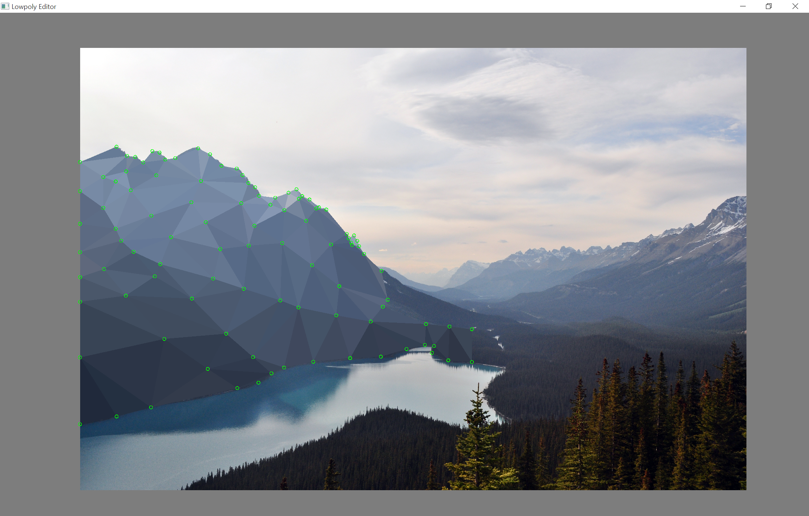

# polyedit
### 2D lowpoly editor heavily based on [this one](raincomplex.net/lowpolyeditor)

### Screenshots

### Libraries
This project uses:
* [SFML](http://www.sfml-dev.org/)
* [Tiny File Dialogs](https://sourceforge.net/projects/tinyfiledialogs/)
* [jsoncpp](https://github.com/open-source-parsers/jsoncpp)

### Building
